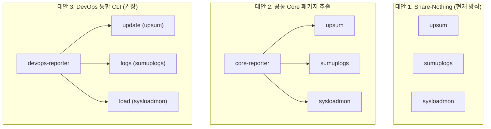

# DevOps 모니터링 도구군 아키텍처 리뷰서

현재 운용 중인 3개의 DevOps 모니터링 도구(`upsum`, `sumuplogs`, `sysloadmon`)는 공통적인 인프라스트럭처 요구사항(Gemini API 연동, SMTP 이메일 발송, 환경 변수 로드)과 서로 다른 비즈니스 로직(로그 전처리, 데이터 스키마, 프롬프트 템플릿)을 가지고 있습니다. 

이를 효과적으로 구조화하기 위한 4가지 아키텍처 시나리오를 비교 평가합니다.

---

## 🏗️ 아키텍처 대안 비교

### 대안 1: 독자 생존 구조 (Share-Nothing) — 현재 방식
각 프로젝트를 별개의 독립된 Git 레포지토리 및 가상 환경으로 유지합니다.

* **👍 장점**:
  * **격리성**: 특정 프로젝트를 수정하거나 의존성을 업데이트할 때 다른 프로젝트에 전혀 영향을 주지 않습니다.
  * **낮은 결합도**: 도메인별 최적화 작업이 자유로우며, 아키텍처 변경에 따르는 사이드 이펙트 우려가 없습니다.
* **👎 단점**:
  * **중복 코드 관리**: API 호출 안정성 체인(Timeout, Retry)이나 SMTP 이메일 전송 로직의 공통 버그가 발견되었을 때 3곳 모두 수동 패치해주어야 합니다.
  * **환경 파편화**: `.env` 파일과 가상환경이 각각 3개씩 파편화되어 배포 및 유지보수 비용이 증가합니다.

### 대안 2: 공통 라이브러리 패키지 추출 (Shared Package)
공통 기능(Gemini API 클라이언트, SMTP 전송기, 기본 HTML/CSS 템플릿 등)을 `devops-reporter-core` 패키지로 떼어내 PyPI에 등록하거나 로컬 경로로 참조합니다.

* **👍 장점**:
  * **코드 재사용성**: 인프라성 유틸리티 코드를 중앙에서 집중적으로 업그레이드하고 버전 관리할 수 있습니다.
* **👎 단점**:
  * **오버엔지니어링**: 프로젝트가 단 3개뿐인 환경에서 별도의 라이브러리 배포 파이프라인을 운영하는 것은 과도한 유지 관리 리소스를 낭비하게 됩니다.
  * **업데이트 결합 파동**: Core 라이브러리의 시그니처가 바뀌면 3개 프로젝트 모두의 종속성을 수동으로 맞춰 배포해야 하는 번거로움이 있습니다.

### 대안 3: 모노레포(Monorepo) 구성
하나의 Git 저장소 밑에 3개 프로젝트를 서브 패키지로 두고, `shared/` 혹은 `core/` 로컬 폴더를 직접 Import하여 참조하게 합니다.

* **👍 장점**:
  * **배포 없이 코드 공유**: 로컬 경로 참조(`path = "../shared"`)를 통해 별도의 라이브러리 패키징 및 배포 단계 없이 실시간으로 수정 사항이 공유됩니다.
  * **통합 관리**: 단일 저장소에서 한 번에 3개 프로젝트의 코드 흐름을 파악하기 좋습니다.
* **👎 단점**:
  * 저장소가 합쳐지므로, 타겟 서버 배포 및 배포 자동화(CI/CD) 스크립트 작성이 다소 정교해져야 합니다.

### 대안 4: 단일 CLI 도구 통합 (DevOps Reporter) — ⭐ 최선의 아키텍처
3개의 프로젝트를 각각 별도의 애플리케이션으로 두는 대신, 하나의 패키지/CLI 도구(예: `devops-reporter` 또는 `sysreport`)로 통합하고, 각각을 **서브 커맨드**로 관리하는 방식입니다.

* **실행 형태**:
  * `$ sysreport update` (기존 `upsum`)
  * `$ sysreport logs` (기존 `sumuplogs`)
  * `$ sysreport load` (기존 `sysloadmon`)
* **👍 장점**:
  * **운영 단일화**: 단 하나의 `.env` 파일, 하나의 가상환경, 하나의 크론탭 등록 명령으로 3가지 감지/분석 주기를 일목요연하게 운용할 수 있습니다.
  * **아키텍처적 일관성**: CLI Core에 환경설정(`BaseSettings`), SMTP 발송, Gemini 클라이언트를 한 번만 구현해 놓고, 각 서브커맨드(update, logs, load)는 자신의 수집기(Collector), Pydantic 스키마(Schema), 프롬프트 템플릿만 등록하도록 플러그인 패턴을 취할 수 있습니다.
* **👎 단점**:
  * 기존에 독립적으로 돌고 있던 3개 레포지토리의 결합을 위한 초기 마이그레이션 공수(Refactoring cost)가 발생합니다.

---

## 🎯 시니어 엔지니어의 최종 권장안

**"도구의 목적이 동일(DevOps/System Monitoring)하므로, 단일 CLI 도구(`sysreport` 등)로 통합하는 4번 대안을 강력히 추천합니다."**

현재 3개 도구는 사실상 하나의 서버(DietPi) 혹은 로컬 인프라를 지탱하기 위해 일 단위로 도는 DevOps 모니터링 군입니다. 이를 굳이 3개의 다른 실행 파일로 쪼개어 관리하는 것은 설정 관리(`.env` 복제 등)의 중복과 관리 포인트를 3배로 늘릴 뿐입니다.

* **1단계 (단기)**: 단기적으로는 **대안 1(Share-Nothing)**을 그대로 유지하되, 이번에 진행한 고도화 방식(Pydantic Settings, response_schema)을 복사/이식하여 코드 규격을 맞추어 둡니다. (완료)
* **2단계 (중장기)**: 관리 포인트 증가가 부담스러워지는 시점에, 세 프로젝트를 합쳐서 `sysreport` 라는 단일 패키지로 마이그레이션하여 모니터링 CLI 툴을 일원화하는 것을 권장합니다.
