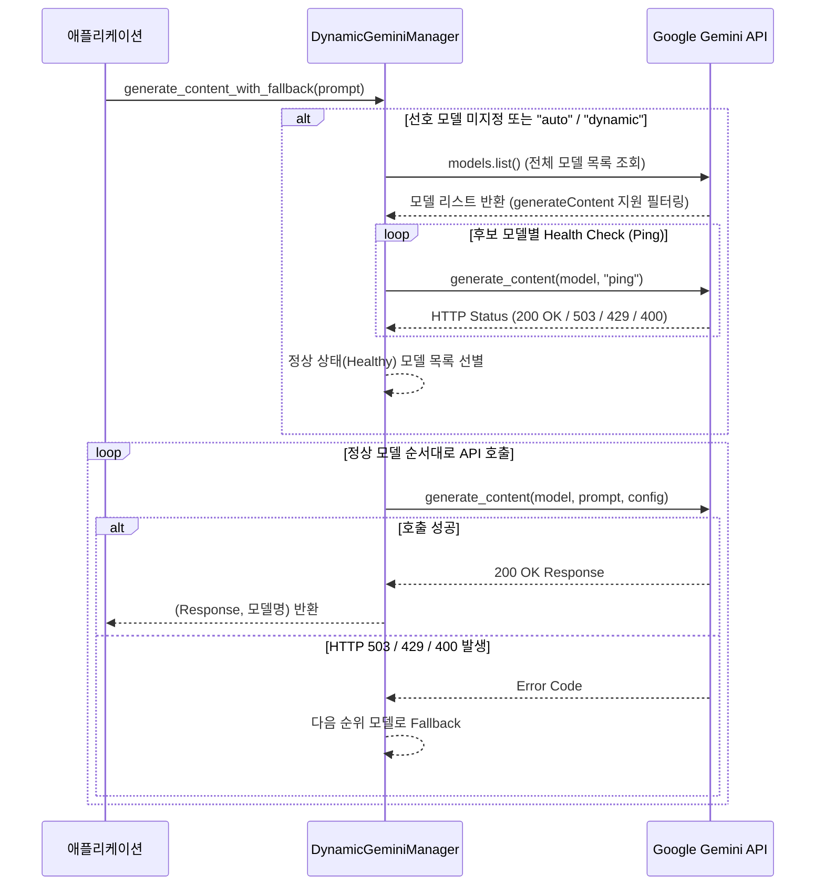

# Dynamic Gemini Model Manager (`gemini_model_manager.py`) 명세서

## 1. 개요
Google Gemini API 서비스의 503 (Service Unavailable - High Demand) 또는 429 (Rate Limit) 오류 발생 시, 고정된 모델 목록에 의존하는 대신 **사용 가능한 Gemini 모델 목록을 API로부터 동적으로 수집하고 실시간 가용성 헬스체크(Ping)를 수행하여 자동 Fallback을 제공하는 파이썬 전용 스마트 관리 모듈**입니다.

---

## 2. 핵심 아키텍처 및 처리 흐름



---

## 3. 클래스 및 주요 메서드 상세

### `DynamicGeminiManager(api_key: Optional[str] = None)`
- **초기화**: `GEMINI_API_KEY` 환경변수 또는 직접 전달받은 API Key를 통해 `google-genai` SDK `Client`를 초기화합니다.

### `fetch_supported_models() -> List[str]`
- API 서버에서 지원하는 전체 모델 목록(`client.models.list()`)을 조회합니다.
- `supported_actions`에 `"generateContent"`가 포함된 모델만 1차 추출합니다.
- `-tts`, `lyria`, `robotics`, `computer-use` 등 텍스트 생성과 무관하거나 오디오 전용인 특수 모델은 자동으로 배제합니다.

### `probe_model_health(model_name: str, timeout_sec: float = 5.0) -> bool`
- 단일 모델에 경량 요청(`ping`)을 전송하여 응답 속도 및 HTTP 상태 코드를 실시간 검증합니다.
- `503 Service Unavailable` 또는 `429 Rate Limit` 감지 시 `False`를 반환하여 헬스체크 목록에서 자동 제외합니다.

### `get_healthy_models(candidate_models: Optional[List[str]] = None) -> List[str]`
- 전체 후보 모델에 대한 Health Check를 실행하여 실질적으로 호출 가능한 정상 모델 리스트만 선별 반환합니다.

### `generate_content_with_fallback(prompt, preferred_models, config) -> Tuple[Response, str]`
- 설정된 우선순위 모델 리스트를 순회하며 요청을 시도합니다.
- 시도 도중 503 / 429 오류가 발생하면 멈추지 않고 즉시 다음 정상 모델로 Fallback을 수행합니다.
- 우선순위 모델이 모두 응답 불능일 경우, 2차 동적 헬스체크 모델 목록을 탐색하여 최종 성공 응답을 가져옵니다.

---

## 4. 환경 변수 연동 (`.env`)

```ini
# "auto" 또는 "dynamic" 지정 시 전체 동적 조회 및 헬스체크 수행
GEMINI_MODELS="auto"

# 특정 선호 모델 지정 (1차 시도 후 실패 시 동적 Fallback)
# GEMINI_MODELS="gemini-3.5-flash,gemini-2.5-flash"
```
